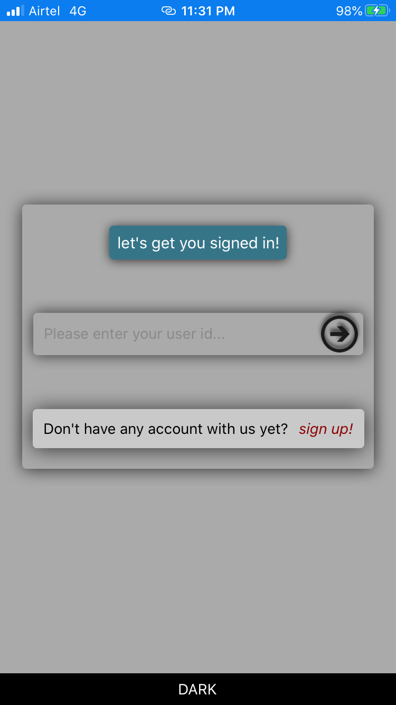
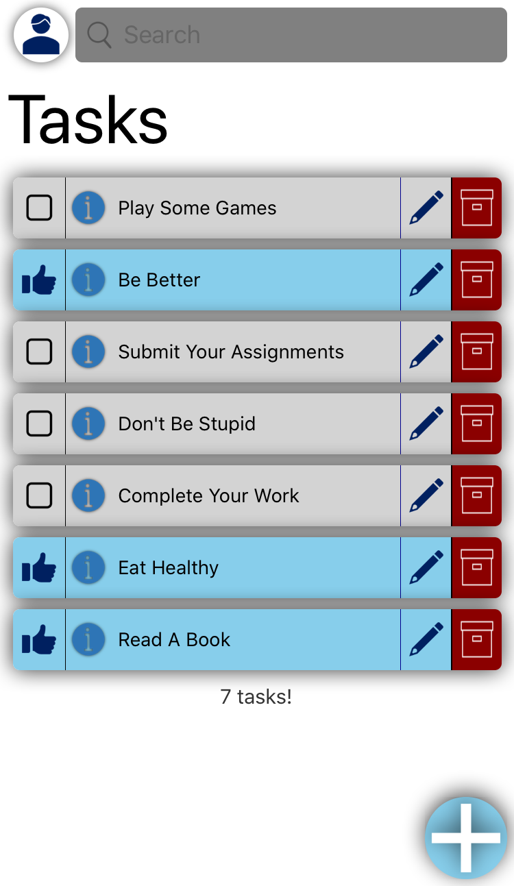

# Tasks App

## About
A simple task keeping app, written in react native for android and iOS devices.

## Features

### Minimal UI
Watch a login or signup with no distractions in action
 
 

 
 

Cleaner home screen, you will find only what you need
 
 

 
 
### Search Support for Tasks
Search seamlessly through all your tasks with an inituitive search.
 
 

 
 
[more about the search](/docs/search)

### Recycle Bin Support
Tasks App comes with a recycle bin support!
See it in action below - 
 
 

 
 
[more about the recycle bin](/docs/recyclebin)

### Dark/light Theme Support
Tasks app comes with dark/light theme mode and can be changed from settings.
 
 
#### Sign In Screen
 
 

 
 