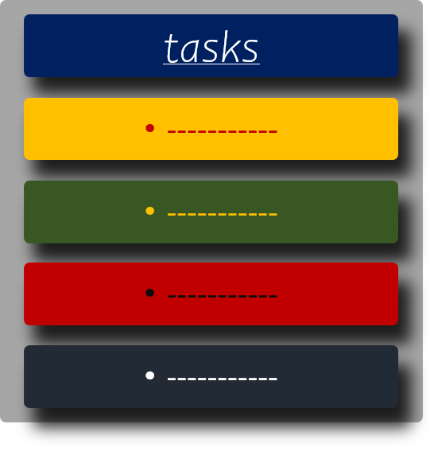
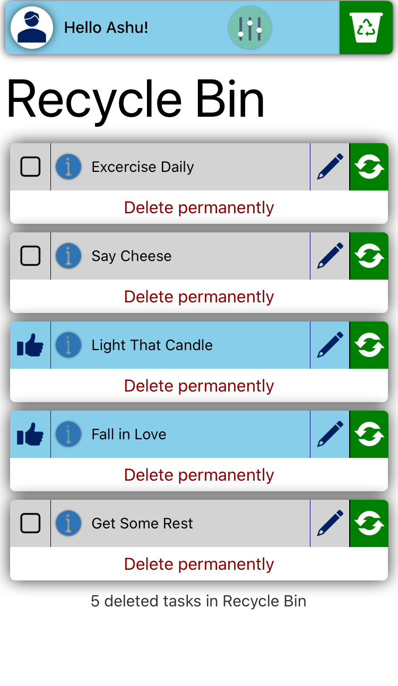
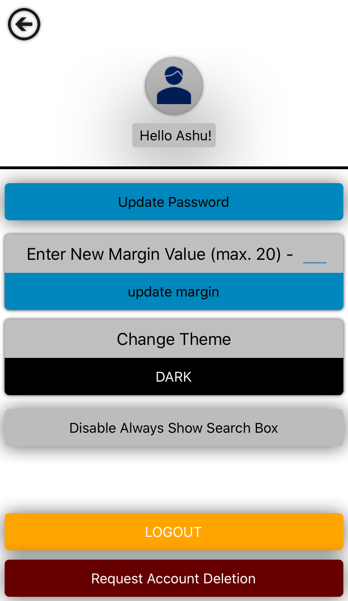
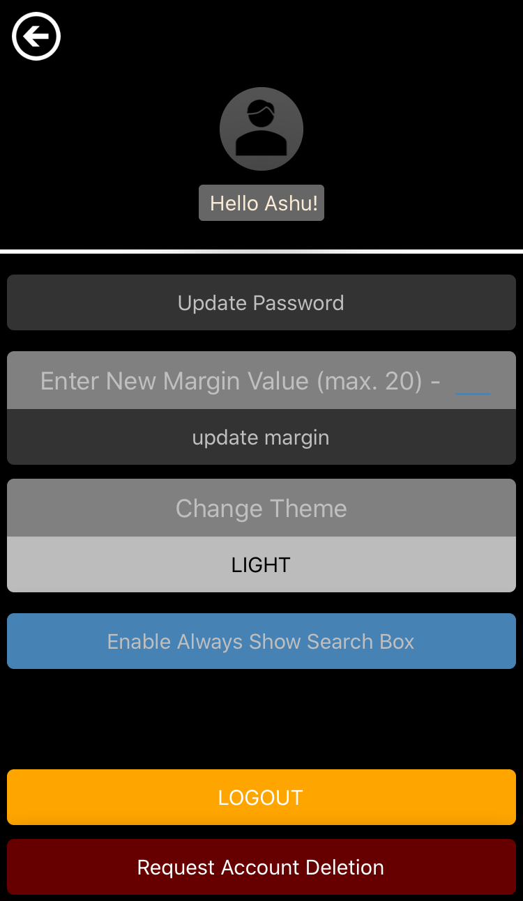

# Tasks App

## About
A simple task keeping app, written in react native for android and iOS devices

## Features

### Minimal UI
Watch a login or signup with no distractions in action

 

Cleaner home screen, you will find only what you need

### Search Support for Tasks
Search seamlessly through all your tasks with an inituitive search.

[more about the search](./docs/search)

### Recycle Bin Support
Tasks App comes with a recycle bin support!
See it in action below - 

[more about the recycle bin](./docs/recyclebin)

### Dark/light Theme Support
Tasks app comes with dark/light theme mode and can be changed from settings

#### Sign In Screen

--------------

--------------

#### Sign Up Screen

--------------

--------------

#### User Home Screen

#### Recycle Bin

#### User Settings Page

# Note
This branch is being tested mainly on iOS platform and may not work as expected/previewed, on android
## Features that will not work as shown are
- Rubber band animation in scrolling behaviour
- Smooth Scrolling
- Shadows (elevation, that is currently available for android doesn't have properties like opacity and offset)
## Features that may not work
- content inset (margin at the end of flatlist that allows add task button to not hinder a note)
- color may not display acuurate in some cases
