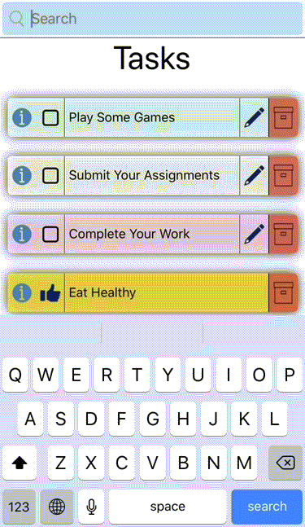

# OverView
Search seamlessly using search in your tasks with cheats

## Always Show Search Mode
In general, your search bar can hide under expanded User Options, but this can be changed in always show search mode

If Always Show Search Mode Is Disabled & Profile Options are not expanded

If Always Show Search Mode Is Disabled & Profile Options are expanded

If Always show search mode is enabled and Profile Options are expanded

## How to access search
- if always show search is enabled, the searchbox is located below an Open Profile option or right to a closed profile menu
 - otherwise hides when profile menu is open

## Options and shortcuts for search
Search comes with certain cheats for user convenience

### filtering results
- adding @complete follwed by space, before the search term shows results for only completed tasks
- similarly adding @incomplete follwed by space, before the search term shows results for only incomplete tasks
- searching for @empty shows empty tasks

### Accessing Recycle Bin
- Recycle Bin can be accessed by typing @deleted
- filtering works seamlessly with Recycle Bin too, [learn how](../recyclebin#search-in-recycle-bin)
